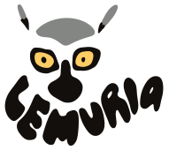

# Lemuria

<p align="center">

</p>
<p align="center">
<em>Otro proyecto más sobre la creación de un mundo virtual 3D y cosas similares.<br>
Impulsado por Nest (o Quart), Angular y Three.js.</em>
</p>

[](https://codeberg.org/7185/lemuria/stars)
[](https://github.com/7185/lemuria/stargazers)
[](https://github.com/7185/lemuria/actions)
[](https://opensource.org/licenses/MIT)
[](https://github.com/7185/lemuria/commits/master)
[](https://www.codefactor.io/repository/github/7185/lemuria) \
[](https://nodejs.org)
[](https://nestjs.com)
[](https://angular.dev)
[](https://threejs.org)

---

## Demo

[Ver Demo Aquí](https://lemuria.7185.fr) (cualquier contraseña es válida)

## Instalación

Primero necesitamos obtener todas las dependencias:

```bash
$ npm ci
```

Luego construimos el frontend:

```bash
# También puedes usar build:prod para construir un paquete listo para producción
$ npm run build -w frontend
```

## Configuración inicial de la DB y el servidor

### Instalar dependencias para el servidor

> [!NOTE]
> Existen dos implementaciones diferentes para el servidor backend: Node o Python. **La versión de Python está obsoleta por ahora porque Prisma ya no funciona con lenguajes de terceros.**

#### Backend de Node
No se necesita nada más después del postinstall de `npm ci`.

#### Backend de Python (obsoleto)
```bash
$ python -m venv venv
$ source venv/bin/activate
$ pip install -r backend-py/requirements.txt
$ PRISMA_PY_DEBUG_GENERATOR=1 prisma generate --schema backend/prisma/schema.prisma --generator client-py
```
### Crear una base de datos vacía e importar los archivos dump

> [!CAUTION]
> Si la base de datos ya existe, los datos del mundo serán sobrescritos.
> 
#### Backend de Node
```bash
$ npx -w backend prisma db push --skip-generate
$ cd backend
$ node --import 'data:text/javascript,import {register} from "node:module"; import {pathToFileURL} from "node:url"; register("ts-node/esm", pathToFileURL("./"));' src/tools/import-lemuria.mts 
```

#### Backend de Python (obsoleto)
```bash
# Ver arriba la configuración del venv
$ PRISMA_PY_DEBUG_GENERATOR=1 prisma db push --schema backend/prisma/schema.prisma
$ cd backend-py
$ PRISMA_PY_DEBUG_GENERATOR=1 python tools/import_lemuria.py
```

Esto creará e inicializará la base de datos `backend/app.db` utilizando los datos en `dumps/atlemuria.txt` y `dumps/proplemuria.txt`.

### Servir los archivos de recursos del mundo

Una vez más, puedes elegir entre node o python para servir los archivos de recursos del mundo. Para evitar problemas de CORS al acceder a archivos estáticos desde un navegador web, haz lo siguiente:

#### Servidor de archivos de Node
```bash
$ npx -y http-server -p 8181 -c-1 --cors
```

#### Servidor de archivos de Python
```bash
$ cd backend-py
$ python tools/serve_path.py
```

Esto ejecutará un script para servir archivos en el directorio actual en el puerto `8181`.
También necesitarás que la ruta de recursos `village2` esté servida; para ello, puedes crear un enlace simbólico ejecutando lo siguiente (pero establece la ruta correctamente primero):

```bash
$ ln -s /my/path/to/resource/directory/for/village2 village2
```

### Ejecutar el servidor

Por defecto, el backend de la API escucha en el puerto `8080`.

#### Backend de Node

```bash
$ npm -w backend run start
```

#### Backend de Python (obsoleto)

```bash
$ PRISMA_PY_DEBUG_GENERATOR=1 prisma generate --schema backend/prisma/schema.prisma --generator client-py # solo es necesario si cambió la versión de prisma o el esquema
$ cd backend-py
$ PRISMA_PY_DEBUG_GENERATOR=1 python app.py
```

## Docker

También puedes generar una imagen de docker para construir el proyecto y ejecutar el servidor en un contenedor:

```bash
# Construir con el backend de node
$ docker build --target node -t lemuria .
# O con el backend de python (obsoleto)
$ docker build --target python -t lemuria .

$ docker run -it -p 8080:8080 -v $PWD/backend/app.db:/app.db lemuria
```
> [!TIP]
> Para mayor seguridad, también está disponible el objetivo `node-distroless`.

### Docker Compose
Aquí tienes un ejemplo de un archivo `compose.yml` utilizando el backend de node y un archivo de clave secreta, escuchando localmente en el puerto `8080` (para ser usado con un proxy inverso).

```yaml
services:
  lemuria:
    container_name: lemuria
    build:
      context: lemuria
      dockerfile: Dockerfile
      target: node
    restart: unless-stopped
    environment:
      TZ: Europe/Paris
      LEMURIA_SECRET_FILE: /run/secrets/lemuria_secret_key
    ports:
      - "127.0.0.1:8080:8080"
    volumes:
      - lemuria/backend/app.db:/app.db
    secrets:
      - lemuria_secret_key
secrets:
  lemuria_secret_key:
    file: secrets/lemuria_secret_key.txt
```

Construir una imagen actualizada es entonces tan simple como `git -C lemuria pull` seguido de un `docker compose build lemuria`.

## Bot

Puedes usar bots de node o python en Lemuria. Consulta los directorios `bot` y `bot-py`.
```ts
// typescript
import {Bot} from './bot'
```
```python
# python
from bot import Bot
```

> [!TIP]
> Un bot de ejemplo `bonobot.ts`/`bonobot.py` está disponible en este repositorio.

## Uso

Una vez que `npm run start` (o `app.py`) y `http-server` (o `serve_path.py`) estén ejecutándose: abre tu navegador web favorito y ve a `http://localhost:8080`,
deberías ver una pantalla de inicio de sesión. Pon cualquier apodo que quieras, la contraseña que proporciones no importa ya que
no hay una autenticación adecuada por el momento.

## Descargo de responsabilidad

El objetivo principal de este proyecto es acceder a mundos de Active Worlds en un navegador web, utilizando archivos dump y rutas a objetos de recursos. La compatibilidad se basa esencialmente en la versión 3.6 del navegador. \
Este proyecto no utiliza ningún código de AW ni de su SDK. \
**Este proyecto NO está asociado con Active Worlds o ActiveWorlds, Inc.**

> [!CAUTION]
> No nos hacemos responsables de cualquier pérdida de datos que pueda ocurrir mientras se utiliza Lemuria. Esto incluye datos del mundo, datos de usuario y cualquier otra información gestionada por la aplicación. Recomendamos encarecidamente realizar copias de seguridad periódicas de sus archivos y base de datos.
