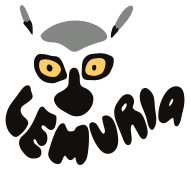

# Lemuria

<p align="center">

</p>
<p align="center">
<em>Yet another project about creating a 3D virtual world and stuff.<br>
Powered with Nest (or Quart), Angular and Three.js.</em>
</p>

[](https://codeberg.org/7185/lemuria/stars)
[](https://github.com/7185/lemuria/stargazers)
[](https://github.com/7185/lemuria/actions)
[](https://opensource.org/licenses/MIT)
[](https://github.com/7185/lemuria/commits/master)
[](https://www.codefactor.io/repository/github/7185/lemuria) \
[](https://nodejs.org)
[](https://nestjs.com)
[](https://angular.dev)
[](https://threejs.org)

---

## Demo

[See Demo Here](https://lemuria.7185.fr)

## Installation

First we need to fetch all dependencies:

```bash
$ npm ci
```

Then we build the frontend:

```bash
# You can also use build:prod to build a production-ready bundle
$ npm run build -w frontend
```

## First DB and server setup

### Install dependencies for the server

> [!NOTE]
> There are two different implementations for the backend server: Node or Python. **The Python version is deprecated for now because Prisma no longer works with third-party languages.**

#### Node backend
Nothing more is needed after `npm ci` postinstall.

#### Python backend (deprecated)
```bash
$ python -m venv venv
$ source venv/bin/activate
$ pip install -r backend-py/requirements.txt
$ PRISMA_PY_DEBUG_GENERATOR=1 prisma generate --schema backend/prisma/schema.prisma --generator client-py
```
### Create an empty database and import the dump files

> [!CAUTION]
> If the database already exists, the world data will be overwritten.
> 
#### Node backend
```bash
$ npx -w backend prisma db push --skip-generate
$ cd backend
$ node --import 'data:text/javascript,import {register} from "node:module"; import {pathToFileURL} from "node:url"; register("ts-node/esm", pathToFileURL("./"));' src/tools/import-lemuria.mts 
```

#### Python backend (deprecated)
```bash
# See above for the venv setup
$ PRISMA_PY_DEBUG_GENERATOR=1 prisma db push --schema backend/prisma/schema.prisma
$ cd backend-py
$ PRISMA_PY_DEBUG_GENERATOR=1 python tools/import_lemuria.py
```

This will create and init the database `backend/app.db` using the data in `dumps/atlemuria.txt` and `dumps/proplemuria.txt`.

### Serve the world resource files

Once again, you can choose between node or python to serve the world resource files. To avoid CORS issues when accessing static files from a web browser, do the following:

#### Node file server
```bash
$ npx -y http-server -p 8181 -c-1 --cors
```

#### Python file server
```bash
$ cd backend-py
$ python tools/serve_path.py
```

This will run a script to serve files in the current directory on port `8181`.
You will also need the `village2` resource path to be served, to do so you can create a symlink by running the following (but set the path correctly first):

```bash
$ ln -s /my/path/to/resource/directory/for/village2 village2
```

### Run the server

By default, the API backend is listening on port `8080`.

#### Node backend

```bash
$ npm -w backend run start
```

#### Python backend (deprecated)

```bash
$ PRISMA_PY_DEBUG_GENERATOR=1 prisma generate --schema backend/prisma/schema.prisma --generator client-py # only needed if the prisma version or the schema changed
$ cd backend-py
$ PRISMA_PY_DEBUG_GENERATOR=1 python app.py
```

## Docker

You can also generate a docker image to build the project and run the server in a container:

```bash
# Build with the node backend
$ docker build --target node -t lemuria .
# OR with the python backend (deprecated)
$ docker build --target python -t lemuria .

$ docker run -it -p 8080:8080 -v $PWD/backend/app.db:/app.db lemuria
```

### Docker Compose
Here's an example of a `compose.yml` file using the node backend and a secret key file, listening locally on port `8080` (to be used with a reverse proxy).

```yaml
services:
  lemuria:
    container_name: lemuria
    build:
      context: lemuria
      dockerfile: Dockerfile
      target: node
    restart: unless-stopped
    environment:
      TZ: Europe/Paris
      LEMURIA_SECRET_FILE: /run/secrets/lemuria_secret_key
    ports:
      - "127.0.0.1:8080:8080"
    volumes:
      - lemuria/backend/app.db:/app.db
    secrets:
      - lemuria_secret_key
secrets:
  lemuria_secret_key:
    file: secrets/lemuria_secret_key.txt
```

Building an up-to-date image is then as simple as `git -C lemuria pull` followed by a `docker compose build lemuria`.

## Bot

You can use node or python bots on Lemuria. See the `bot` and `bot-py` directories.
```ts
// typescript
import {Bot} from './bot'
```
```python
# python
from bot import Bot
```

> [!TIP]
> An example bot `bonobot.ts`/`bonobot.py` is available in this repository.

## Usage

Once `npm run start` (or `app.py`) and `http-server` (or `serve_path.py`) are running: open your favorite web browser and go to `http://localhost:8080`,
you should be prompted with a login screen. Put whatever nickname you want, the password you provide doesn't matter as
there's no proper authentication for the moment.

## Disclaimer

The main aim of this project is to access worlds of Active Worlds in a web browser, using dump files and paths to resource objects. Compatibility is essentially based on browser version 3.6. \
This project does not use any code from AW or its SDK. \
**This project is NOT associated with Active Worlds or ActiveWorlds, Inc.**

> [!CAUTION]
> We cannot be held responsible for any loss of data that may occur while using Lemuria. This includes world data, user data and any other information managed by the application. We strongly recommend that you make regular backups of your files and database.
